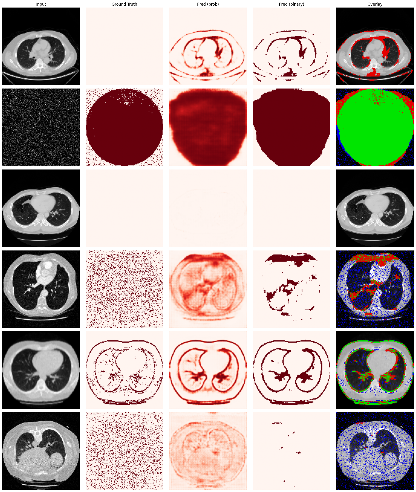

# ACD-LR: Benchmarking Deep Learning for Anatomical Completeness Detection in Low-Resource Settings

In low-resource medical regions, the ability to ensure complete CTs is crucial to minimize costs and resource usage. This project evaluates and benchmarks multiple 3D segmentation architectures for detecting synthetic corruptions in CT scans, using the LUNA16 dataset.

**[Launch App](https://doutori-acd-lr-demo.hf.space/)** — No installation required.



## Important Links

| [Timesheet](https://1sfu-my.sharepoint.com/:x:/g/personal/hamarneh_sfu_ca/IQD5ZONvPfSPQoJO-sf4h3DTARjtVALMua4Mh8MvwCrvAzY?e=USFcHz) | [GitHub Repository](https://github.com/sfu-cmpt419/2026_1_project_11) | [Project Report (Overleaf)](https://www.overleaf.com/3468189672jgrmtvkrsrrj#9c71d8) |
|-----------|---------------|-------------------------|

## Repository Structure

```
repository
├── src/
│   ├── main.ipynb           ## Full training & evaluation notebook
│   ├── app.py               ## Streamlit web app for interactive demo
│   ├── requirements.txt     ## Python dependencies
│   ├── .streamlit/          ## Streamlit config (light mode, no deploy button)
│   ├── data/                ## Sample test scans (.npz files)
│   ├── models/              ## Place downloaded model weights here
│   └── research/            ## Earlier research notebooks
├── README.md
└── .gitignore
```

## Dataset

We use the [LUNA16 dataset](https://zenodo.org/records/3723295) (~888 CT scans). Synthetic corruptions (cropping, motion blur, slicing, noise, etc.) are applied to generate training data. Four sample scans are included in `src/data/`.

## Code Overview

All project code (preprocessing, training, evaluation, and analysis) is in `src/main.ipynb`. This notebook was run on Kaggle with GPU and covers:

- Data preprocessing and synthetic corruption generation
- Training of all three models (3D U-Net, 3D Residual U-Net, 3D Attention U-Net)
- Per-corruption and overall evaluation metrics (Dice, IoU)
- Visualizations and model comparison

### Reproducing Training Results

1. Upload the notebook to [Kaggle](https://www.kaggle.com/) and add the LUNA16 dataset as an input
2. Alternatively, run locally by setting environment variables to point to your data:
   ```bash
   export LUNA16_DATA_DIR="/path/to/luna16/subsets"
   export LUNA16_MASK_DIR="/path/to/seg-lungs-LUNA16"
   export OUTPUT_DIR="./dataset_3d_maps"
   ```
3. A GPU is strongly recommended — training takes ~8 hours on a P100

## Web App

We provide a Streamlit web app for interactively testing the trained models on sample scans.

## Live Demo (Cloud)

**[Launch App](https://doutori-acd-lr-demo.hf.space/)** — No installation required. Runs on Hugging Face Spaces.

### Local Setup

### 1. Download Model Weights

Download the trained model weights from Google Drive:

**[Download Models (Google Drive)](https://drive.google.com/drive/folders/1JUga8AbjGj9JfE606_bqcvlTCV99Ydx-?usp=sharing)**

Place the three `.pth` files into `src/models/`:
```
src/models/
├── best_unet.pth
├── best_resunet.pth
└── best_attn_unet.pth
```

### 2. Install Dependencies

```bash
cd src
python3 -m venv .venv
source .venv/bin/activate
pip install -r requirements.txt
```

### 3. Run the App

```bash
cd src
source .venv/bin/activate
streamlit run app.py
```

The terminal will display a Local URL — open it in your browser.

> **Note:** The first launch may take 1-2 minutes as PyTorch and MONAI load for the first time. After clicking Run Inference, please allow 10-30 seconds for the model to process the scan. The 3D Residual U-Net is the largest model and will take the longest.

### Using the App

1. Select a model from the sidebar (3D U-Net, 3D Residual U-Net, or 3D Attention U-Net)
2. Select a sample scan from the dropdown
3. Click **Run Inference** and wait for it to finish
4. Use the Z-axis slider to scroll through slices and view the predicted corruption mask
